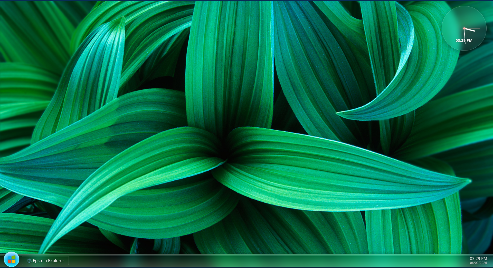
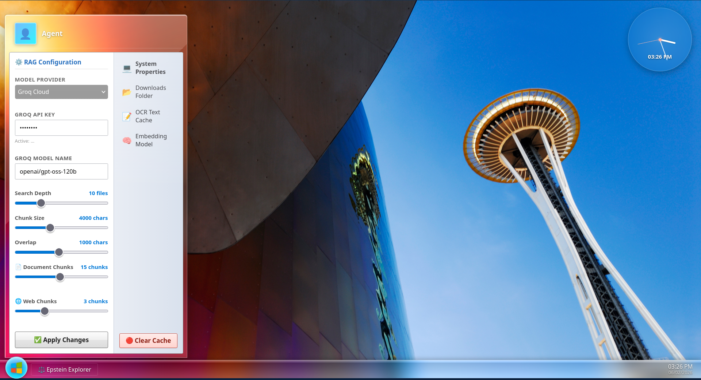
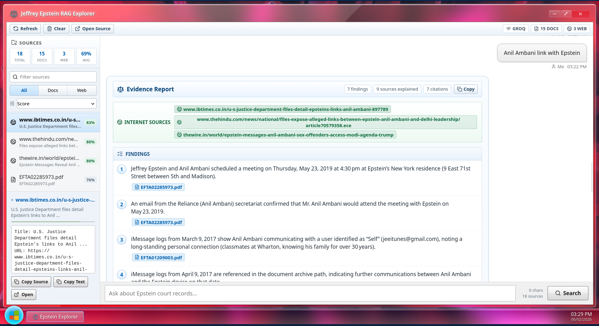
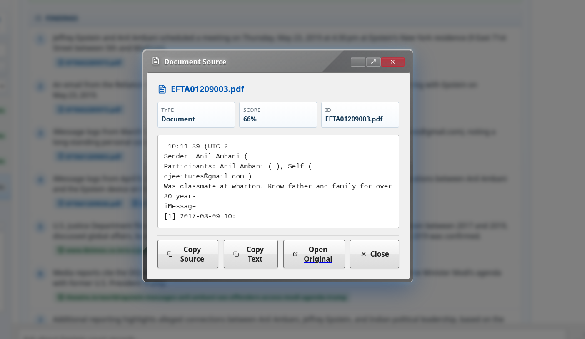

# ⚖️ Jeffrey Epstein Federal Records RAG Explorer

Welcome to the **Jeffrey Epstein Federal Records RAG Explorer**! This application is an advanced, high-performance legal search tool equipped with local semantic intelligence. It lets you ask natural-language questions and searches both **official Jeffrey Epstein federal court PDFs** (scanned FBI files, flight logs, court hearings, witness testimony) and **reputable internet sources** simultaneously to synthesize fully cited, structured answers.

The user interface is modeled directly after the iconic **Windows 7 Aero Glass** desktop environment, complete with glowing gradients, draggable windows, desktop shortcuts, dynamic system gadgets, and sound-effect copy dialogs.

---

## 🔍 The Reverse Engineering Story: Bypassing the Federal Bot Check

The official U.S. government multimedia page hosting the Jeffrey Epstein files utilizes strict bot protection and gatekeeping checks (including age verification and Queue-It integration) designed to prevent automated scripts and web scrapers from mass-downloading the PDF files. 

Normally, these services challenge clients with complex cookies (`ak_bmsc`) and redirects to block programmatic crawlers. 

However, during early development, I reverse engineered the network flow of these requests to study how the server validates active verification states. By monitoring traffic headers and cookie handshakes, I made an incredible discovery: **the federal media server does not actually validate or verify the authenticity of the verification cookies on the server-side.** 

It merely checks if the age-verification flag is present in the cookie payload!

By discovering this server-side oversight, I engineered a highly elegant bypass: if you inject the header cookie `"justiceGovAgeVerified": "true"`, the media endpoint bypasses the verification gates completely, allowing instant, authenticated downloads of court files. This was a classic reverse-engineering marvel that saved the pipeline from relying on heavy browser-automation workarounds like Playwright or Selenium.

### 🧪 Educational Sandbox (`scripts/` folder)
If you want to study the original research, raw experiments, and structural thinking that went into this discovery, you can check the [scripts](file:///mnt/files/Projects/Pending/JefferyEpsteinRag/scripts) folder:
- **[fetchtoken.py](file:///mnt/files/Projects/Pending/JefferyEpsteinRag/scripts/fetchtoken.py)**: Original attempt utilizing a headless chromium browser (`playwright`) to fetch real cookies dynamically.
- **[temp.py](file:///mnt/files/Projects/Pending/JefferyEpsteinRag/scripts/temp.py)**: Raw network exploration showing the first success of bypassing the cookie check by mocking age-verification payloads.
- **[ocr.py](file:///mnt/files/Projects/Pending/JefferyEpsteinRag/scripts/ocr.py)**: Initial experiments testing text layout extraction and running tesseract scanning.

This sandbox is preserved exactly as it was during research for anyone wishing to study the reverse-engineering process behind modern web pipelines.

---

## 📸 Visual Interface Guide

To help you understand and get familiar with the system, here are the screenshots located in your [artifacts](file:///mnt/files/Projects/Pending/JefferyEpsteinRag/artifacts) folder:

### 1. 🖥️ The Aero Glass Desktop
When you launch the app, you will be greeted by a full-fledged classic Windows 7 desktop background.

* **What you see**: High-fidelity glassmorphism framing your primary explorer window, animated desktop shortcuts for dossiers, a bottom taskbar with an interactive Start orb, and a fully functional sidebar clock gadget (matching classic Windows Desktop Gadgets).

### 2. ⚙️ Start Menu & LLM Configurations
By clicking on the glowing blue **Start Button** in the bottom-left corner of the taskbar, you open the system control panel.

* **What you see**: The Start Menu provides standard system links and hosts all RAG pipeline sliders:
  * **Model Provider**: Swap between **Google Gemini**, **Groq Cloud**, and **Local Ollama** instantly.
  * **API Keys**: Configure your API keys for Gemini or Groq Cloud securely.
  * **Document Chunks**: Determine how many PDF text chunks from federal files to feed the LLM.
  * **Web Chunks**: Set how many Google/DuckDuckGo search chunks to incorporate (set to `0` to run in 100% private offline file mode!).

### 3. 💬 Running RAG Searches
Enter your question in the search input box at the bottom of the chat panel and hit Enter.

* **What you see**: A classic Windows "File Copying" progress dialog appears instantly. It updates you in real-time as the backend carries out keyword optimization, downloads missing PDFs from the federal government, performs OCR text scanning, encodes vectors, and synthesizes answers.

### 4. 🧠 Reading Cited Findings
Once the pipeline finishes, the dialog fades out and the final response is displayed in the chat area.

* **What you see**: Answers are structured with clear bullet points, source citations (PDF files or web URLs), and separate relevance analysis tables describing exactly what evidence was extracted from every single source file in the retrieval set.

### 5. 🔍 Navigating Retrieved Evidence
The sidebar on the left displays all retrieved files and websites ranked by their semantic similarity match score.

* **What you see**: Sort sources by score, name, or type. You can click on any card to read a full text preview of the corresponding evidence chunk, copy it to your clipboard with a single click, or click inline PDF/URL badges inside chat responses to open specific documents instantly in your browser.

---

## 🛠️ Step-by-Step Installation

Follow these simple instructions to install and run the application on your computer:

### Prerequisites
Make sure you have the following installed on your machine:
1. **Python** (version 3.10 or higher) — to run the backend server.
2. **Node.js** (version 18 or higher) & **npm** — to build and run the React frontend.
3. **Tesseract OCR** (required for reading scanned text from PDF documents):
   * *Ubuntu/Linux*: `sudo apt-get install tesseract-ocr`
   * *macOS*: `brew install tesseract`
   * *Windows*: Download the installer from the official Github project.
4. **Poppler Utilities** (required for converting PDF pages to images for OCR scanning):
   * *Ubuntu/Linux*: `sudo apt-get install poppler-utils`
   * *macOS*: `brew install poppler`
   * *Windows*: Download binaries and add them to your system PATH environment.

---

### Setup Instructions

#### Step 1: Open the Directory
Open your terminal in the project directory:
```bash
cd /mnt/files/Projects/Pending/JefferyEpsteinRag
```

#### Step 2: Run the Installer Script
We have provided an automated `install.sh` script to set up everything automatically:
```bash
./install.sh
```
*(This sets up your virtual environment, installs backend requirements, installs frontend packages, and compiles the React distribution assets).*

#### Step 3: Configure Your Environment (.env)
Create a `.env` file in the root directory (you can copy the provided `.env.example` as a starting point):
```ini
MODEL_PROVIDER="gemini"
API_KEY="YOUR_GEMINI_API_KEY_HERE"
GROQ_API_KEY="YOUR_GROQ_API_KEY_HERE"
PORT="3000"
```

---

## 🚀 Running the Application

Once everything is set up, starting the application takes a single command:

#### Start Frontend & Backend
Run the automated start script in the root directory:
```bash
./start.sh
```
This runs both servers concurrently and handles their lifecycle gracefully!

Open your favorite browser and navigate to:
```text
http://localhost:3000
```
Enjoy exploring the Jeffrey Epstein federal archives within a premium Windows 7 glassmorphic desktop environment!
